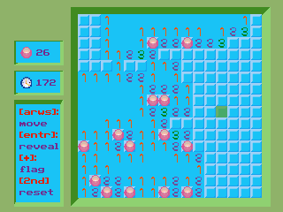
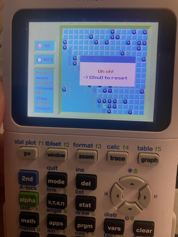

A minesweeper recreation made specifically for the TI-84 Plus CE calculator. The source code is mostly a one-filer in src/main.c.

**Ready to use binary (~5.7 kb):** https://github.com/duskitism/ti84_minesweeper/blob/main/bin/MINESW.8xp

# Showcase

